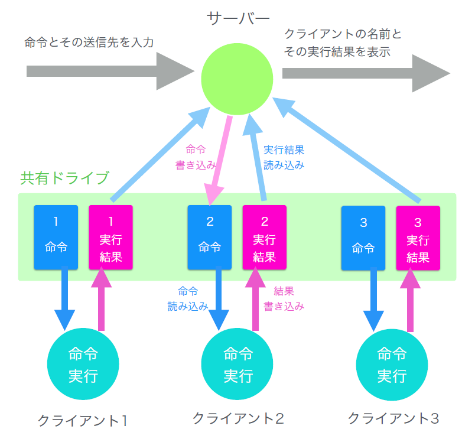

## なにこれ

コマンド入力で相手のホストを遠隔操作するソフトです。

デモ映像は無いのですが、主な使い方としては

- クライアントPCの画面の監視
- クライアントPCのCDトレイを一斉にパカパカ開ける
- クライアントPCの画面にダイアログを表示
- クライアントPCで勝手に音を鳴らす

といったことができるように作ったソフトです。

## 環境・言語

Windows向けソフトで、HSPを使って制作しました。

## コンテストで入賞しました

このソフトは中学3年生の頃に作って、学校法人岩崎学園の「第30回中高生ソフトウェアアイデアコンテスト」に応募したところ、横浜市長賞(3位)を受賞しました。

「ツールを使って何か作るのではなく、ツールを作るところがいいね」と講評をもらえました。

## 制作の経緯

中学2年生のとき、プログラミングをやってみたくてパソコン部に入部しました。

### 共有フォルダで遠隔操作

HSPに入門してから毎日、自分でプログラムを書いたり、ネット上に投稿されたプログラムを実行してみたりと楽しく活動していたのですが、中学2年生のあるとき、学校のネットワーク共有フォルダを使って、他のホストを遠隔操作するプログラムが書けないかと思いつきます。

どういうことかというと、命令保存ファイルと実行結果保存ファイルを各クライアント毎に、共有フォルダに用意しておき、

- サーバープログラム側
  - 各クライアントの命令ファイルに命令を書き込む
  - 各クライアントの実行結果ファイルを読み込んで画面に出力. 読み込んだファイルの内容は削除.
- クライアントプログラム側
  - 自分の命令ファイルの命令を読み込んでそれを実行する. 読み込んだファイルの内容は削除.
  - 自分の命令ファイルに命令の実行結果を書き込む.

という処理を繰り返せば、サーバー・クライアント型の遠隔操作ができるという考えです。

中学3年生の5月、実際にこのソフトを icommander という名前で作ったのですが、こんな風に連続的に共有ファイルを読み書きして、万が一学校のファイルサーバーをダメにして怒られたら嫌だし、そもそも共有ファイルがあるところでしか遠隔操作できないんじゃ格好悪いので、いつか1対1の本格的な通信ができるように改良したいなあと思ったのでした。

(ここで、コマンドの構文解析とかどうしたのって話ですが、やり方をググって出てきた「パーサ」とか「トークナイザ」とかの仕組みを理解するでもなく、適当に先頭から文字列を読んでいって適当にコマンドと引数を分離する、中学生がすぐ思いつく程度の貧弱な構文解析しかしてないです。)

### コンテスト応募のためにネットワークを勉強

それから中学3年の8月になりました。

部活では毎年、9月に行われる、岩崎学園の『中高生ソフトウェア・アイデア・コンテスト』に一人一つ何か応募することになっていて、僕はせっかく icommander を作ったのでこれを応募したいと思いましたが、先にも言った通り共有ファイルがある環境でしか動作しないので、これでは応募できないと思い、締め切りまでの1か月で icommander に1対1の通信機能を盛り込むことを決意したのでした。

とはいってもネットワークについて何も知らず、ソケット通信のやり方が分からなかったので、受験勉強(中3の夏なので)には目もくれず、1からネットワークの勉強をして icommander にソケット通信機能をなんとか実装して、コンテストへの提出にこぎつけました。

結果、コンテストで横浜市長賞(3位)を受賞することができました。
