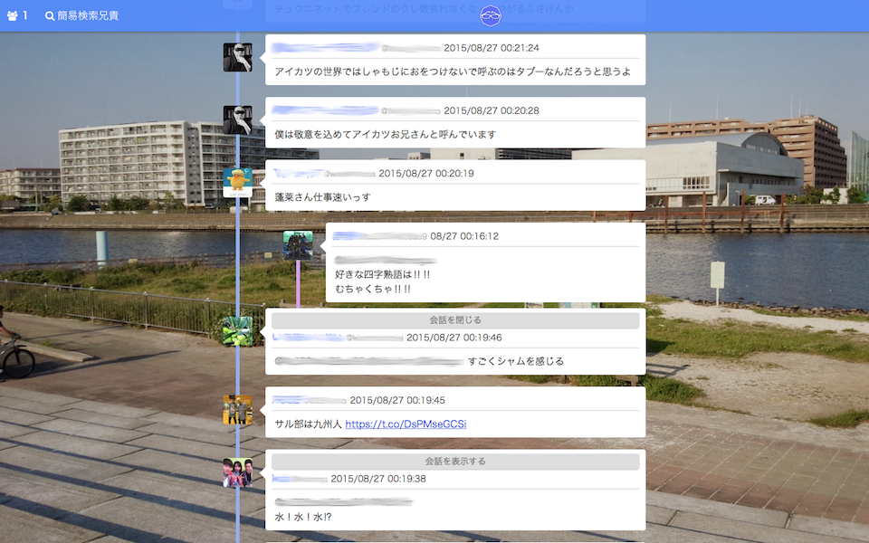
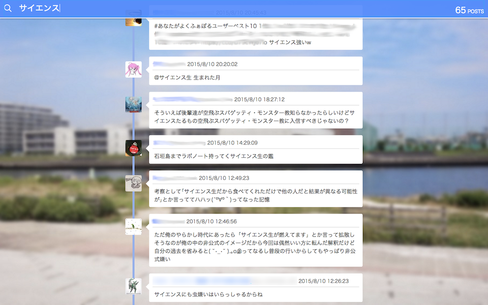
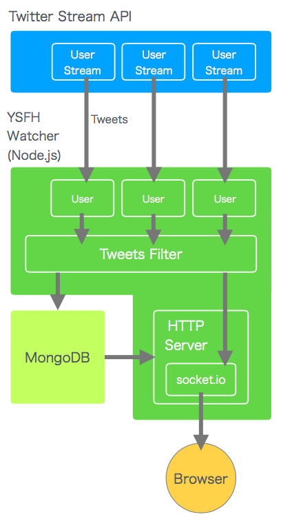

## なにこれ

YSFH Watcherは横浜サイエンスフロンティア高校の生徒のつぶやきが垂れ流されるサイトでした。

所属していた部活、情報工学部の夏の行事に「夏アプリ」というのがあって、これは夏休みに何か一つ制作物を作って発表する行事で、YSFH Watcherはこの夏アプリの制作物として作りました。表向きは。

実際のところは、自分の高校のTwitterの、目に余るタイムラインを全世界に晒し上げようと思って作りました。(ゲス顔)

タイムラインはSocket.ioを使ってリアルタイムで更新されるようにしていて(TwitterにUserStreamが存在したころの話)、Meteor.jsによる検索機能もつけていました。

生徒のTwitterアカウントのリストは手動で管理していました。本当はTwitterユーザーのクラスタリングをして自動でYSFH生を判別出来たらいいなあとか思ってましたが難しそうだったので諦めました。

このYSFH Watcherは、倫理的に問題ありだったのでしばらくしてから公開を停止しました。

## 構成 

<small>実は構成はこんな感じになっていたのですが、なぜかソースとなるUserStreamがたくさんありますね…なぜでしょうね？</small>
