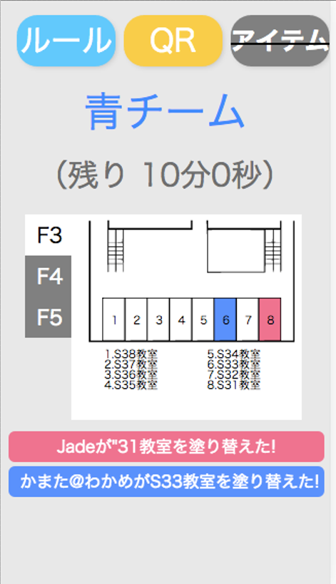

## なにこれ

Splaturn(スプラターン)は、所属していた情報工学部(部活)の文化祭の出し物として作ったリアル(？)陣取りゲームのWebアプリです。

スマートフォンのブラウザを使って、校内の壁に貼り付けられたQRコードを撮影してその部屋を自チームの陣地にして、10分間で取れた陣地の数を競うゲームです。

今でいうPokemon GOみたいな感じですが当時はまだPokemon GOは登場していませんでした。

アイデアを考えたのは友達で、私はNode.jsでサーバーサイドを書きました。

    

まず参加者は赤もしくは青のチームに振り分けられます。

地図を見ながら色を塗り替えたい部屋まで移動し、その部屋の壁のどこかに貼り付けられている4cm四方程度の小さなQRコードを探し、それを撮影することでその部屋を自分の色で上書きすることができます。

10分間の間により多くの部屋に色を塗ることができたチームが勝利です。

ゲームは全回満員で参加者は総勢100人を超え大盛況となりました。

アンケートでは9割以上の参加者から「とても面白かった」「まあまあ面白かった」の回答を得ることができ、好評でした。

## 裏話

本当は任意の部屋の色を消すアイテムとか、任意の部屋の色を変えられないようにするアイテムとかを用意していたんですが、クライアントサイドの実装が間に合わずにポシャりました。
