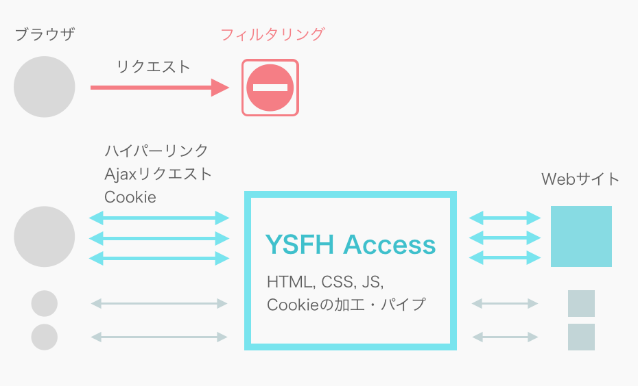
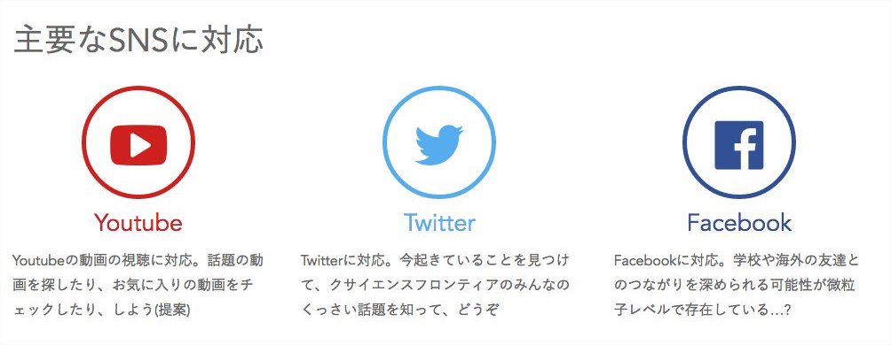
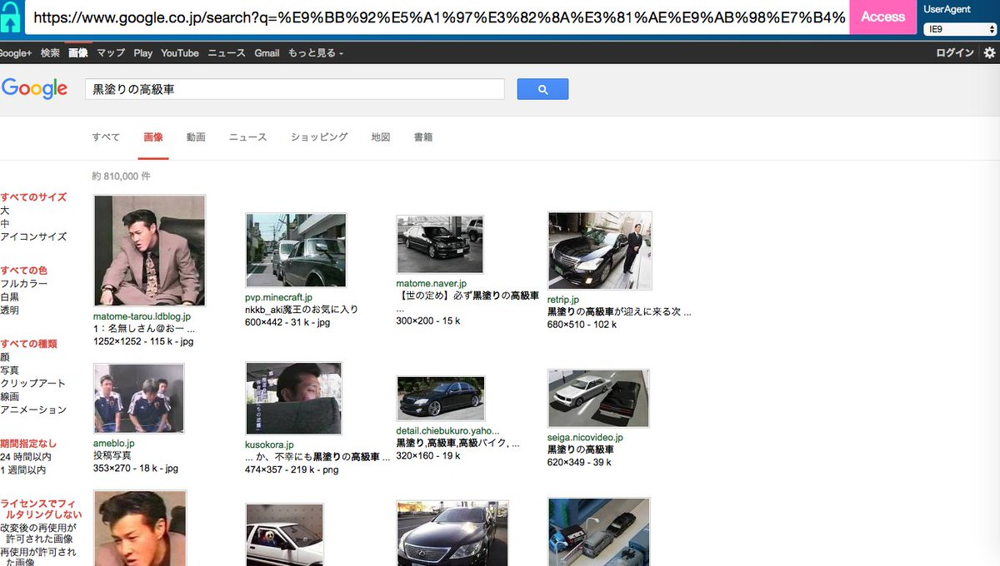

YSFH Accessは高校のインターネットのフィルタリング機能を回避するために作ったWebプロキシサイトです。

Proxysite.comの代替として開発しました。

組み込みのXHRオブジェクトを置き換えるスクリプトを仕込むことで、Ajax通信もバイパスできるようになっています。

  

YouTube, Twitter, Facebook, Google画像検索などを利用できます。

  

  

## 開発中の実験の様子

ブラウザがlocalhost以外のホストに接続できない(直接インターネットに繋がらない)ようにファイヤウォールを設定した状態でYouTube動画を再生するテストです。

<blockquote class="twitter-tweet" data-lang="en">
やったぜ。 ローカルホスト以外との通信を遮断した状態でYoutubeを観ることに成功したゾ。  これで学校からどんなサイトでも閲覧できるサービスが作れるってはっきり分かんだね。 <a href="https://t.co/Sh1hIGqz3w">pic.twitter.com/Sh1hIGqz3w</a>
&mdash; いの (@iciclize) <a href="https://twitter.com/iciclize/status/700346247161327617?ref_src=twsrc%5Etfw">February 18, 2016</a></blockquote>

リポジトリ: [https://github.com/iciclize/YSFHAccess](https://github.com/iciclize/YSFHAccess)