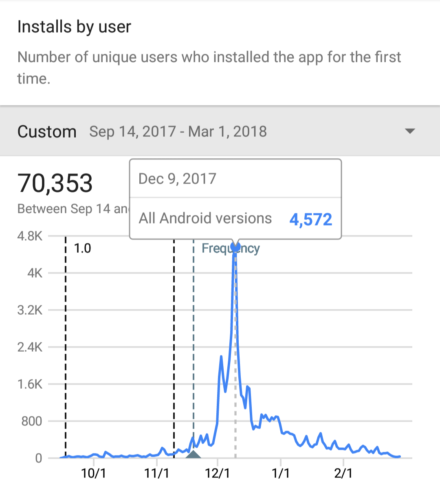

起動しておくと、忘れた頃に画面のランダムな場所に「熱盛」と出てしまうアプリです。

2017年8月24日の報道ステーションで「熱盛」のテロップが出てしまう放送事故が発生。ネット上では「熱盛」がバズりました。

これは作らなきゃ(使命感)と思ったので同年9月15日にこのアプリをリリースしました。(「熱盛」は同年10月頃に商標出願されました。「熱盛」は株式会社テレビ朝日の登録商標です。)

12月頃からびっくりするくらい急にダウンロード数とコメント数が伸びて12月中旬には5万ダウンロードになり、一時期Playストアのスポーツカテゴリ(大嘘)で1位を獲得しました。

これは想定外でしたが、n分間に一回熱盛と出てしまうことを利用してスマホの使いすぎを防ぐ兄貴が多いようです。

ダウンロード数が多くなると広告業者がオファーを送ってくるようになるんですね。

[熱盛と出てしまうアプリ - Google Playのアプリ](https://play.google.com/store/apps/details?id=net.iciclize.atsumori)