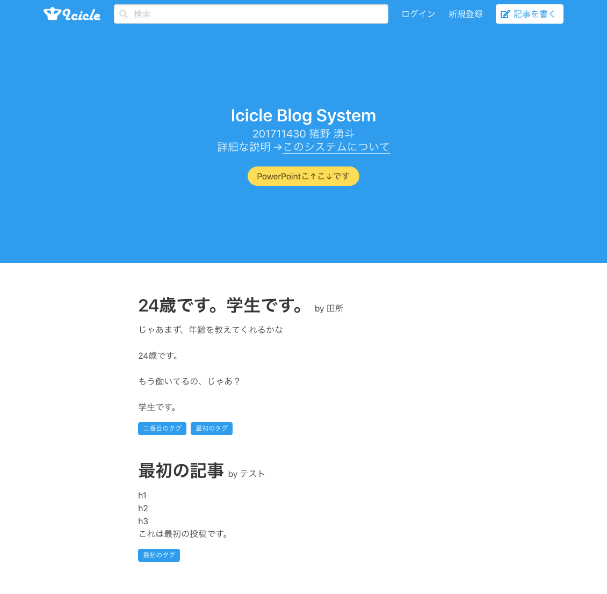
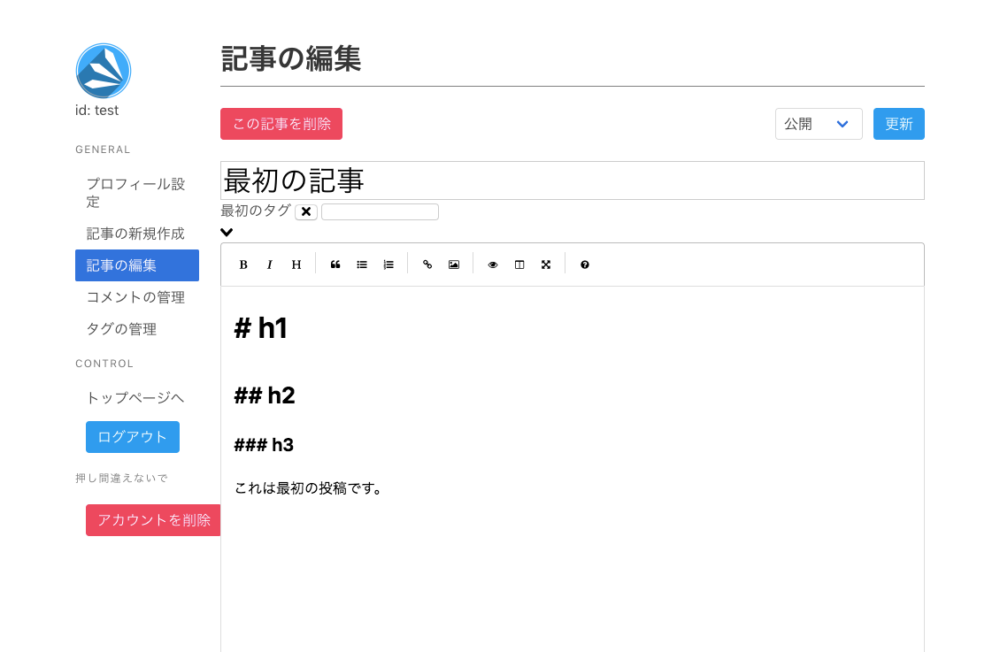
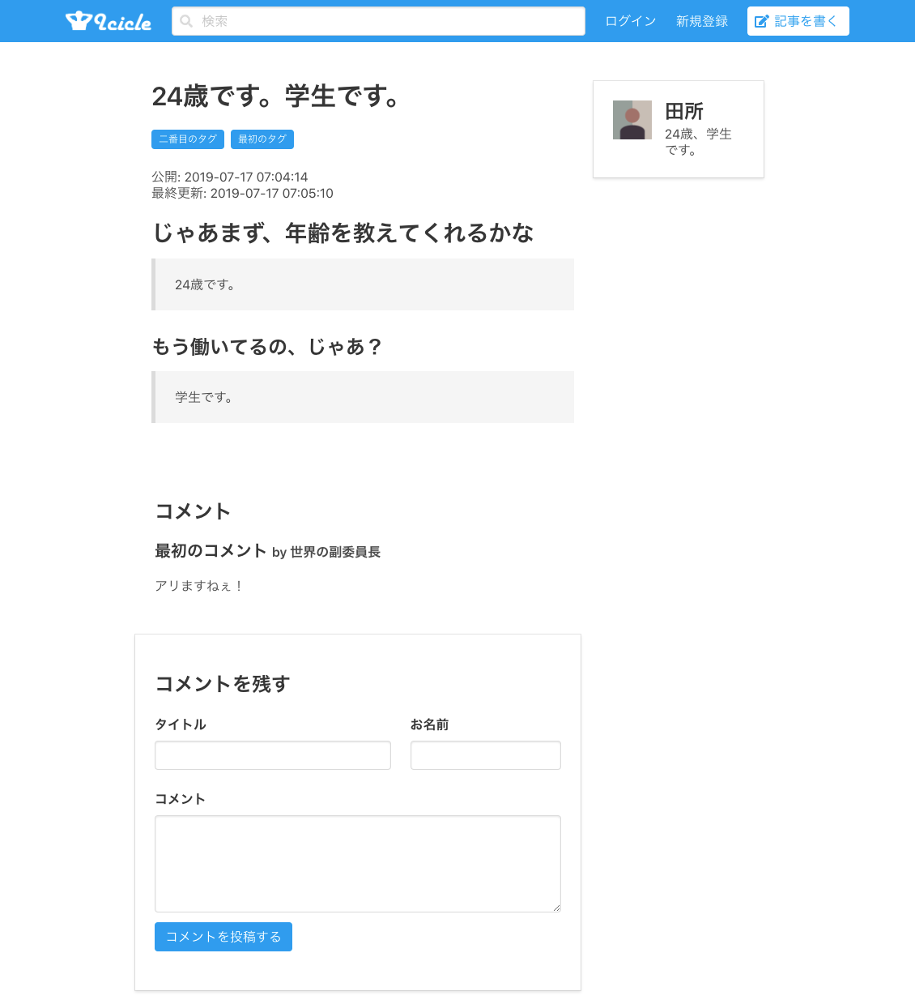
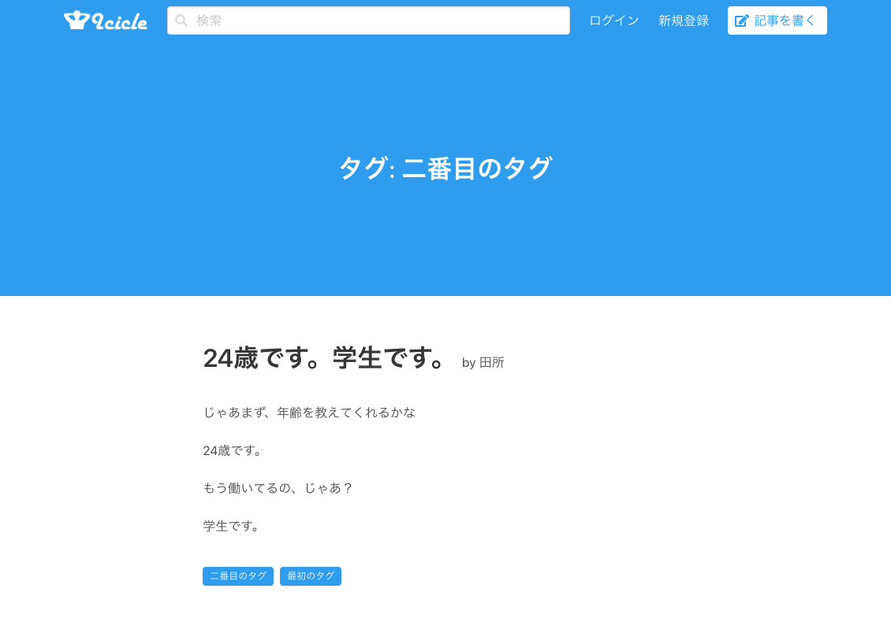

Icicle Blog Systemは大学のデータベースの授業の課題で作ったブログシステムです。PHP + MySQL + Vue.js + Bulmaで作りました。

完成までにやることが多すぎて数日ほど大学の計算機室にほとんど泊まり込むような形で制作しました。

`Vue.jsもPHP初めて` && `締切最優先` のためセキュリティはガバガバですが授業の課題だしまあしょうがない(割切)。

BulmaもVue Componentsも便利すぎて泣いた。

## トップ画面

## 記事編集画面

タグも付けられる。

## 記事ページ

コメントも付けられる。

## 絞り込み・検索

タグ, 書いた人, 本文・タイトルで検索できる。

このときブログはもう二度と作りたくないと思いましたが変ですね、また作ってしまいました。