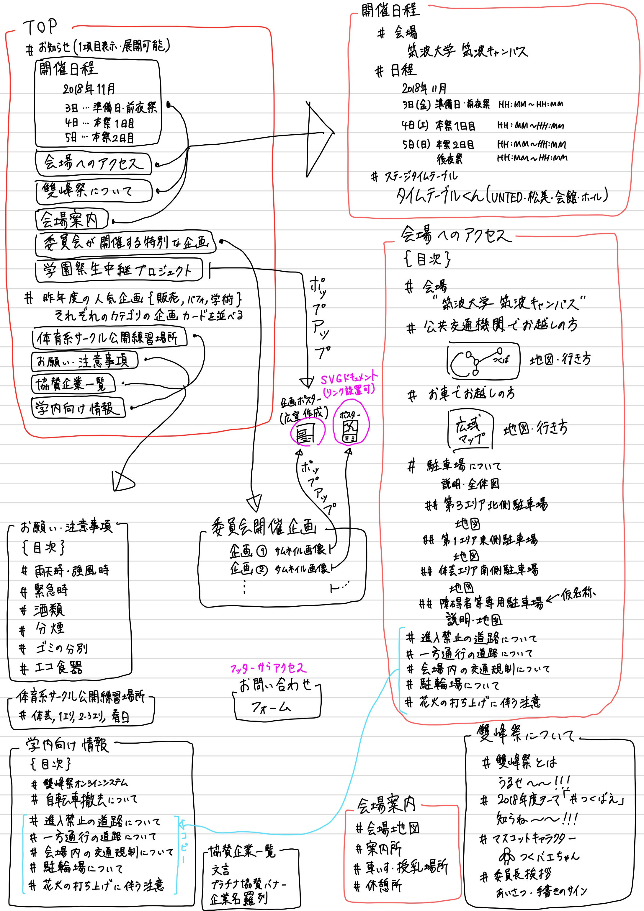
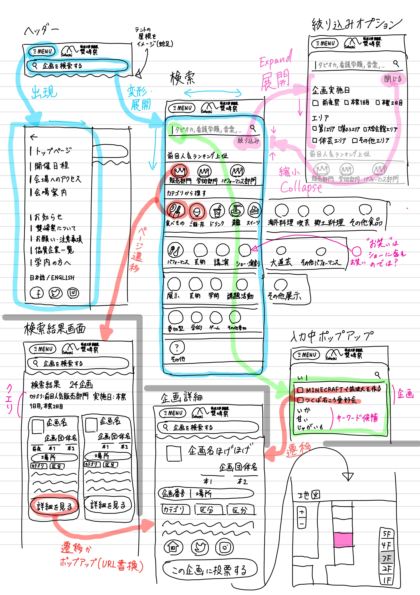

## なにこれ・なにしたの

2018年度の筑波大学学園祭「雙峰祭」のWebサイト制作に携わりました。

制作メンバーは10+人で、僕は主にWebデザインとサイトの内容を考え、制作の指揮をしました。

他には、SVGインタラクティブ実装のために、部屋ごとマークアップされたSVGマップの設計とその制作の指揮や、新入生にWebやGitのレクチャーを行ったりしていました。

## デザインの実物スクリーンショット

レガシーな2カラムにちょっとモダンなグラデーションを用いて、可愛い感じのデザインに挑戦しました。

今思うとなんじゃこりゃって感じなんですけど…

### トップページ

### 各種情報ページ

### キーワード・カテゴリと絞り込み条件による検索のページ

### 企画詳細・インタラクティブ地図ページ

部屋の場所まで表示できるようになっています。

## コンテンツの設計

利用者が知りたい、日程、企画一覧、アクセス方法について素早く確実に情報が得られるように内容を考えました。

## 地図の話

このWebサイトは、キーワード・カテゴリによる企画検索機能に加え、企画の実施場所をインタラクティブに確認できるSVG地図を実装しています。

インタラクティブ地図を実装するために、屋外テント設置場所のほか、企画で使われるほとんどの建物を一部屋一部屋SVGにマッピングする必要があったため、メンバーを動員してマッピングを行いました。

地図UIならびに現在地の表示などはメンバーの一人に開発を任せました。現在地の表示を頼んだ覚えはなかったのに、GIMPか何かを使ってGPS座標をSVGマップ座標に変換する変換行列を割り出して現在地表示を行っていてびっくりしました。

## あんまり携わってない場所の技術について

フレームワークにNuxt.jsを使っています。僕はNuxt.jsを使ったことがなかったのですが、ほかのメンバーがリードしてくれたので、多少理解しました。

企画検索バックエンドは学園祭の企画登録システム(雙峰祭オンラインシステム, 通称SOS)が提供するGraphQLサーバーで、情報の取得(Apollo)および表示はメンバーの一人にお願いしました。

## ちょっと反省

掲載情報について他の部署との連携があんまりうまくいってなかったので政治力も大事だなあと思いました(小並感)
