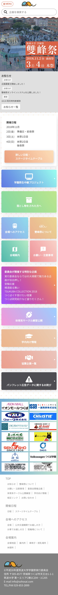
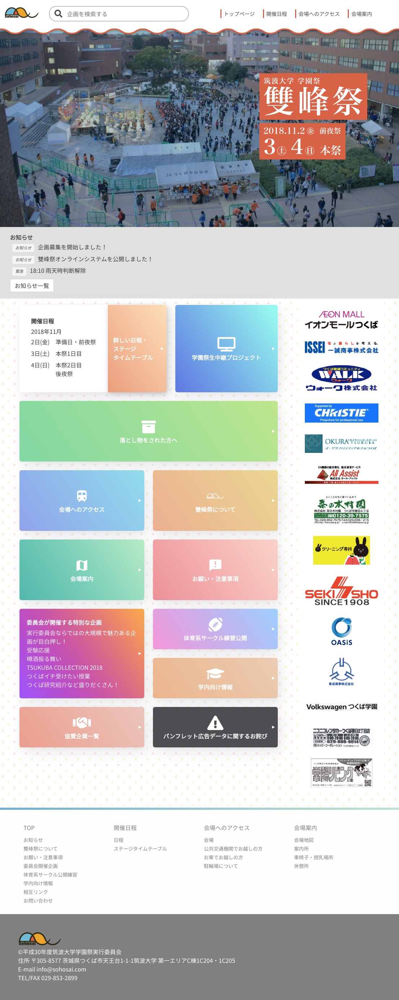
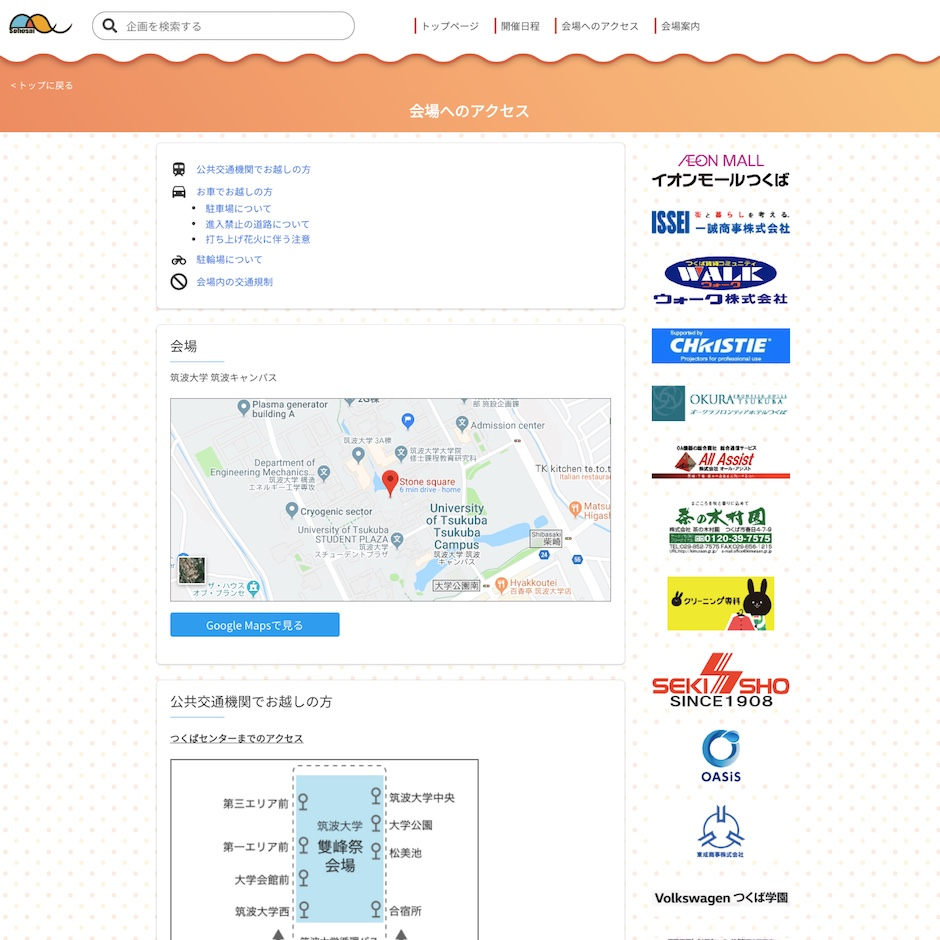
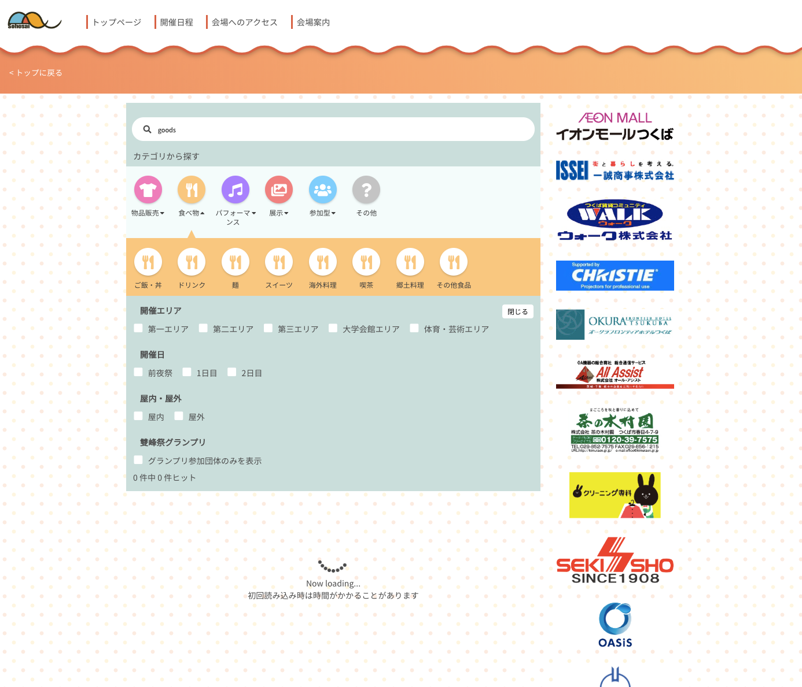
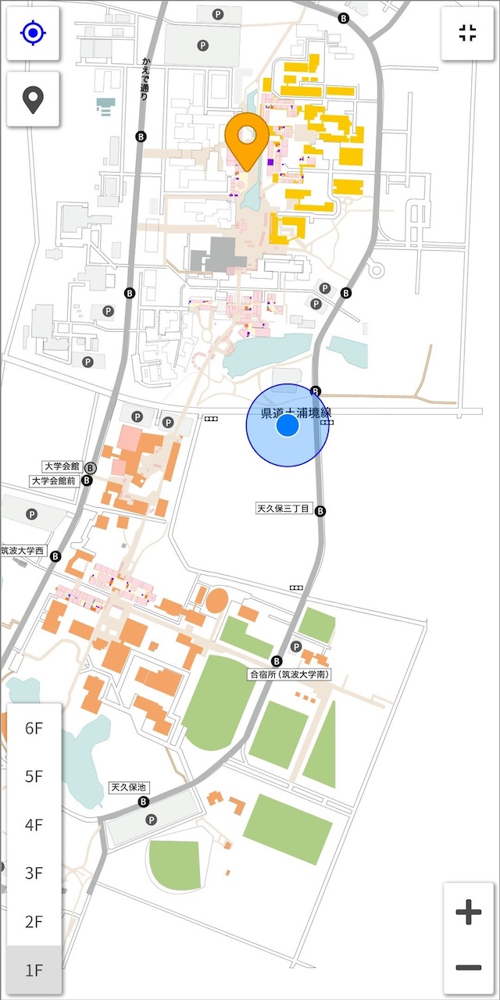

2018年度の筑波大学学園祭「雙峰祭」のWebサイトを作りました。Nuxt.jsを使っています。

製作メンバーは10+人で、僕は主にデザインやコンテンツを考えて製作の指揮をしました。

キーワード・カテゴリによる企画検索機能に加え、企画の実施場所をインタラクティブに確認できるSVG地図が実装されていました。

## トップページ

可愛い感じのデザインに挑戦しました。今思うとなんじゃこりゃって感じですね。

## 各種情報ページ

## キーワード・カテゴリと絞り込み条件による検索

バックエンドは学園祭の企画登録システム(雙峰祭オンラインシステム, 通称SOS)が提供するGraphQLサーバーで、情報の取得および表示はメンバーの一人にお願いしました。

## SVGインタラクティブ地図

インタラクティブ地図を実装するために、屋外テント設置場所のほか、企画で使われるほとんどの建物を一部屋一部屋SVGにマッピングする必要があったため、メンバーを動員してマッピングを行いました。

地図UIならびに現在地の表示などはメンバーの一人が開発してくれました。現在地の表示を頼んだ覚えはなかったのに、GIMPか何かを使ってGPS座標をSVGマップ座標に変換する変換行列を割り出して現在地表示を行っていてびっくりしました。

