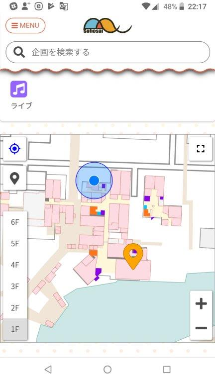

2018年度の筑波大学学園祭「雙峰祭」のWebサイト作りました。Nuxt.jsを使っています。

製作メンバーは10+人で、僕は主にデザインやコンテンツを考えて製作の指揮をしていました。

キーワード・カテゴリによる企画検索機能に加え、企画の実施場所をインタラクティブに確認できるSVG地図を実装していました。

## トップページ

## 検索窓をタップするとカテゴリが出現

キーワードの入力中にサジェストも出ます。

  

## キーワード・カテゴリと絞り込み条件による検索

## 企画情報詳細ページ

## SVGインタラクティブ地図

地図を実装するために、屋外テント設置場所のほか、企画で使われるほとんどの建物を一部屋一部屋をSVGにマッピングしています。

(この画像では縮尺が大きすぎて(大学が広すぎて)個々のテントや部屋まで確認するのは難しいですが…)

## 各種情報ページ

