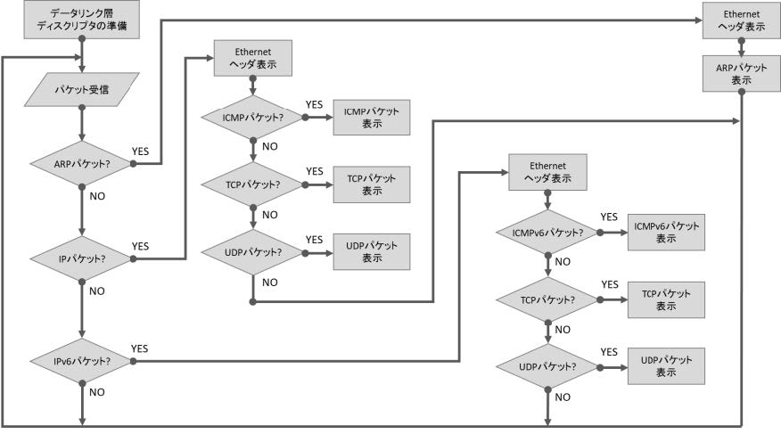
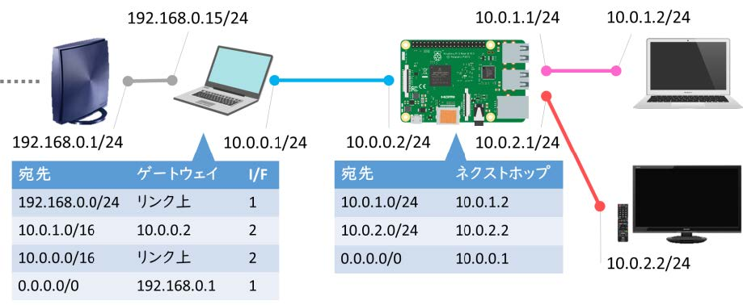

小俣光之『ルーター自作でわかるパケットの流れ』を写経してパケットキャプチャ・ブリッジ・ルーターを作ってRaspberry Piで実行しました。

<blockquote class="twitter-tweet" data-lang="en"><p lang="ja" dir="ltr">買ったぜ。😎😎 <a href="https://t.co/jhCVUDEFyq">pic.twitter.com/jhCVUDEFyq</a></p>&mdash; いの (@iciclize) <a href="https://twitter.com/iciclize/status/990489175148261376?ref_src=twsrc%5Etfw">April 29, 2018</a></blockquote>
<script async src="https://platform.twitter.com/widgets.js" charset="utf-8"></script>

## 動機

表示されるWebサイトの画像が全部野獣先輩に置き換わるルーターあったら面白い…面白くない？

## パケットキャプチャできた

<blockquote class="twitter-tweet" data-lang="en"><p lang="ja" dir="ltr">とりあえずパケットキャプチャができたのでブリブリとブリッジ作っていきたいですね <a href="https://t.co/wZMTG2qVuc">pic.twitter.com/wZMTG2qVuc</a></p>&mdash; いの (@iciclize) <a href="https://twitter.com/iciclize/status/1035615798331498496?ref_src=twsrc%5Etfw">August 31, 2018</a></blockquote>

パケット解析の流れはこんな感じです。



## ブリッジできた

<blockquote class="twitter-tweet" data-lang="en"><p lang="ja" dir="ltr">おー自作ブリッジがフレームをパススルーしてテレビにIPアドレスが割り当てられたぜ</p>&mdash; いの (@iciclize) <a href="https://twitter.com/iciclize/status/1036328102035484672?ref_src=twsrc%5Etfw">September 2, 2018</a></blockquote>

## ルーターできた

<blockquote class="twitter-tweet" data-lang="en"><p lang="ja" dir="ltr">やっと端末がインターネットに繋がった………<br>写経してからここまでたどり着くのにめちゃくちゃ時間かかった <a href="https://t.co/iN7pj2EL5a">pic.twitter.com/iN7pj2EL5a</a></p>&mdash; いの (@iciclize) <a href="https://twitter.com/iciclize/status/1073055995805425664?ref_src=twsrc%5Etfw">December 13, 2018</a></blockquote>



こんな環境で実験しました。

ルーター自作本にはルーティングテーブルが実装されていないかったのでHirochika Asai氏によるradix treeの実装を利用させてもらいました。

[https://github.com/drpnd/radix_tree](https://github.com/drpnd/radix_tree)

<!--
## ポイント

### データリンク層の扱い方

```
int soc; // ソケット(ファイルディスクリプタ)
/* ソケット生成
 * SOCK_RAW    RAWソケット
 * ETH_P_ALL   (IPだけでなく)すべてのパケットを受信 */
soc = socket(PF_PACKET, SOCK_RAW, htons(ETH_P_ALL));

struct sockaddr_ll sa;
sa.sll_family = PF_PACKET; // プロトコルファミリ
sa.sll_protocol = htons(ETH_P_ALL); // プロトコル
sa.sll_ifindex = ifreq.ifr_ifindex; // インターフェース番号

bind(soc, (struct sockaddr *)&sa, sizeof(sa));
```

socket(), bind()でソケットを設定してからread()システムコールを呼び出すとEthernetフレーム(のコピー)が手に入る。

### チェックサムの計算

各プロトコルのチェックサムの計算方法は同じで、検査対象となるデータに対して16ビットごとの1の補数和(ビット反転したもの同士を足す。ただし桁が溢れたら最下位ビットに1を足す)をとって、さらにその1の補数をとる(ビット反転)。
-->

## 大変だったところ

ルーターを動かす実験環境を作るのに手間取りました。

ルーターを写経してすぐ動くかというと全然そんなことはなく、インターネットに届いたパケットのechoが返って来ない罠にはまりました。

原因は何かというと、WAN側の家庭用ルーターの経路表にRaspberry Piルーターへの経路がないことだと分かりました。

しかし、家庭用ルーターの経路表を書き換えようにもうちのルーターにはその機能はありませんでした。

なので上位でNAPTをしてくれるLinuxルーターを別に構築してみたのですが、自分でUbuntuの経路表をいじったりiptablesを使ったりした経験がなかったので、コマンドの使い方にちょっと手間取りました。

問題の解決に効いたポイントをいくつかメモしておきたいと思います。

### iptablesでNAPT(IPマスカレード)

```
iptables -t nat A POSTROUTING o enp7s0 j MASQUERADE
```

パケットを転送させるには `/proc/sys/net/ipv4/ip_forward` を1にしておかなければいけない。

### 経路の追加と削除

```
route add net 10.0.1.0 netmask 255.255.0.0 gw 10.0.0.2 eth2
route del net 10.0.1.0 netmask 255.255.0.0 gw 10.0.0.2 eth2
```

### ゲートウェイが「リンク上」であることの意味

ゲートウェイが「リンク上」(on linkとか"*"とも表記される)とは、直接接続されているという意味であり、つまり、ホストが相手ホストのMACアドレスを調べることができない状況では通信ができないということ。

続きはまだ製作中です(TCPのACK番号を偽装する必要があってちょっと難しい)。
