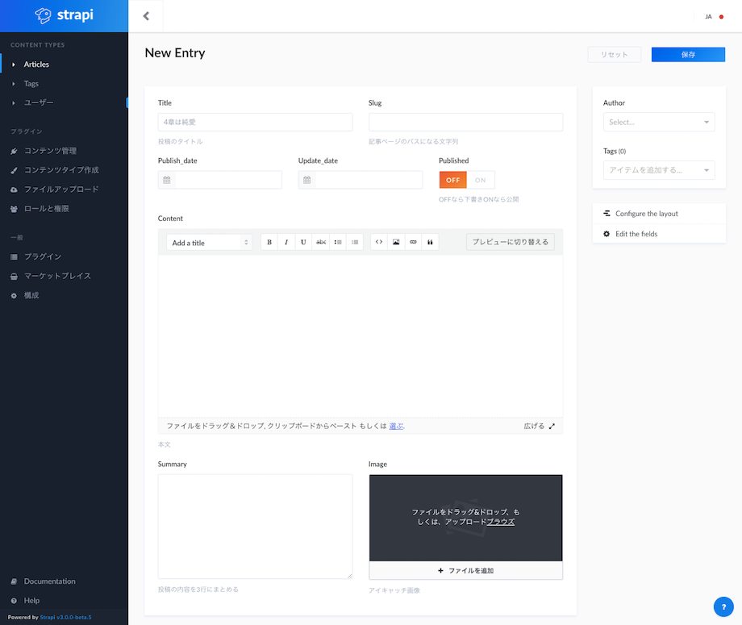

このサイトのことです。静的サイトジェネレーターGatsbyで制作しました。制作期間はトータルで1ヶ月くらいですね。

このサイトはブログでありポートフォリオサイトでもあります。広告やアナリティクスを設置していません。

バックエンドにStrapiというNode製のHeadless CMSを使っています。これは、自由にスキーマ(コンテンツタイプと呼ばれる)を定義でき、その管理のためのリッチな画面が作れるほか、GraphQLエンドポイントまで提供してくれます。

こんな画面で記事を書いています。

別にStrapi自身はブログのためのプラットフォームではありませんが、まるでブログを書くために作られたかのような画面を簡単に構築することができます。

ビルドについては、ブログの内容を更新したときにビルドが走るように設定しています。

静的サイトなので生成されたアセットをまるごと公開ディレクトリにコピーすればデプロイは完了です。

同時に2つ以上のプロセスでビルド・デプロイが行われないように、Task Spoolerというツールでビルドコマンドをキューイングしています。

CI？ないです。
