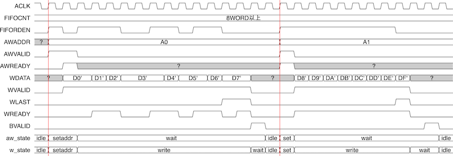
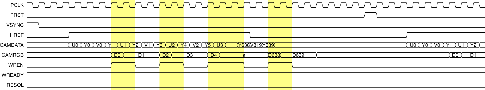

3年次の学生実験(の代わり？)として受講できる、FPGAでビデオカードを設計するコース「組み込み技術キャンパスOJT(COJT) ハードウェアコース」の1年間の成果として「透明人間回路」という作品を発表しました。

<small>動画内で言ってること意味不明すぎワロタ</small>

    <iframe src="https://www.youtube.com/embed/y0vV2u8ot3w?start=427" frameborder="0" allow="accelerometer; autoplay; encrypted-media; gyroscope; picture-in-picture" allowfullscreen style="width: 100%; height: 100%; position: absolute; top: 0; left: 0;"></iframe>

作品のタネとしては、「画面の右半分の、肌っぽい色以外のピクセルを左半分に転送すると、画面の左半分に映っている人間が透明人間に見える」というものです。

作品としてはそんなに映えるものではないのですが、製作の道のりがなかなか険しかったのでその頑張りをこの作品集のページに載せたいのです。

## COJT ハードウェアコースとは

> 　春学期は「映像信号の入出力」をテーマに、基本的なハードウェア記述言語の記述方法を学んだ後、ディスプレイに映像を出力するための表示回路と、カメラから映像を取り込むためのキャプチャ回路を構築し、基礎を固めます。秋学期は「グラフィックスLSIとSoC設計」をテーマに、映像信号の加工やテクスチャの描画を行うグラフィックスLSIの設計を行い、最終的にはそれらを用いて各自がオリジナルの組み込みシステムを提案し、プレゼンテーションを行うことで、実社会で通用する応用力を身につけます。
 
 
<small>(<a href="http://www.cojt.or.jp/tkb/outline/index.html">COJTのホームページ</a>より引用)</small>

端的に言えばビデオカード設計コースです。

ざっくりとした工程は以下の通り。

1. HDMI信号を作ってディスプレイに認識されるようにする
2. 映像出力しながらVRAMを読み出せるようにする、すなわち、任意の画像を出力できるようにする
3. Webカメラからのキャプチャ画像をVRAMに書き出せるようにする、ただしこのときYUV信号はRGB信号に変換する。これが完成するとWebカメラの映像がディスプレイに出力されるようになる。
4. VRAM上の画像データに任意の色やVRAM上の別の領域を合成できるようにする。最大で2つのVRAM領域を同時に読み出しながら、両者に演算を行いながら、VRAMに書き戻すという作業になる。

これをOSもCPUも無いところでやります。

もうちょっと具体的には、各工程において、下のようなタイミングチャートを考えて、

それをVerilog HDLによる論理回路記述に落とし込みます。

### 表示回路

「FPGAボード上のDDR3メモリから画像を読み込み、その画像をHDMI信号としてディスプレイに出力する課題」

文章にすればこれだけの課題です。が、それが難しいのです。

まずはHDMI信号を自力で生成するところから始まります。

与えられた資料を読みながら、水平同期信号と垂直同期信号を決まった長さ、決まった数で生成・出力します。

同期信号がうまくディスプレイに認識してもらえたら、いよいよ映像信号の出力なのですが、これが難しい。

いつもならソフト側でVRAM(メモリ)に任意の画像データを書き込めば、それをハードウェア側が映像信号として出力してくれるものですが、今回はそのハードウェアそのものを作っているのです。

したがって、メモリに対するアクセスを自力で行う必要があり、それはつまり、メモリのアドレスバスとその制御信号線に自分で0,1を書き込んでタイミングよくメモリとの通信を行わなければならないということを意味します。

メモリバスはAXIバスというインターフェースによって定義されていて、バスに対する操作はすべてこのAXIバスプロトコルに従う必要があります。

COJTハードウェアコースの本質はAXIバスに対するコントローラを記述するというところにあるのです。

アドレスバスに送るアドレスの生成、VALID信号の生成、READY信号の確認はどうやって、いつ行うか、その条件は？

FIFOにデータを溜め込みすぎて溢れないようにするにはアドレスバスをどういうタイミングで、どういう条件で操作すれば良いのか。

垂直・水平同期信号のタイミングに合わせたFIFOからの読み出しを過不足ないように行うにはどのような条件を見れば良いのか。

どういう状態を定義してどういう条件で状態遷移するべきか。

複雑に絡み合う条件を上手にまとめた論理回路を設計します。

また、表示回路の動作を設定するためのインターフェースであるレジスタも設計します。

レジスタというのは、CPUからハードウェアを操作するための唯一のインターフェースです。バス上でCPUからレジスタ(の割り当てられたメモリ空間)宛に送られてくる読み書きの要求をさばきます。

「読み込み」と「書き込み」と聞くと対象性を感じますが、読み込み・書き込みの要求に対してハードウェアがどういうアクションを起こすのか、どういう値を返すのかはハードウェアの勝手なので、書き込みはできるけど読み戻そうとしても0しか返さないみたいな設計も行えます。実際、COJTの教材ではそういう設計が求められます。

この表示回路、まあなかなか一筋縄では行きませんでした。画面が映らないとか、映像が乱れる、映像がずれるみたいなトラブルが起きました。

### キャプチャ回路

表示回路が「メモリから読み込む」回路だったのに対して、キャプチャ回路は「Webカメラからのデータをメモリに書き込む」回路です。

ただ書き込むのではなく、Webカメラから得られるUYVYデータをRGBデータに変換しながらメモリに書き込みます。

表示回路が作れればそんなに難しいものではないです。

これが完成するとディスプレイにWebカメラの映像が出力されるようになります。

### 描画回路

VRAMやレジスタに対する読み書き演算モリモリの、総まとめみたいな複雑な課題です。

CPUによってレジスタに書き込まれる独自のグラフィックスコマンドをを解釈・実行する回路です。

命令に従って、指定された範囲の画像をメモリから読み込み、画素に対して透過や合成などの演算を行い、またメモリに書き戻すことが求められます。

定義する状態数とか状態遷移が多くなって考えるのに苦労しました。

命令に応じて処理すべき画素が何行何列かと範囲が変動するので、適切にメモリアドレスを生成しなければなりません。さらに、画素の演算は1クロックでは間に合わないので数クロック分パイプライン処理をしなければならないのですが、これがまた他の信号のタイミングに影響したりと難しいのでした。

<small>ちなみに描画回路まで完成させたのは最終的に12人中4人だったことを考えるとちょっと褒めてくれてもええんやでという感じです</small>
