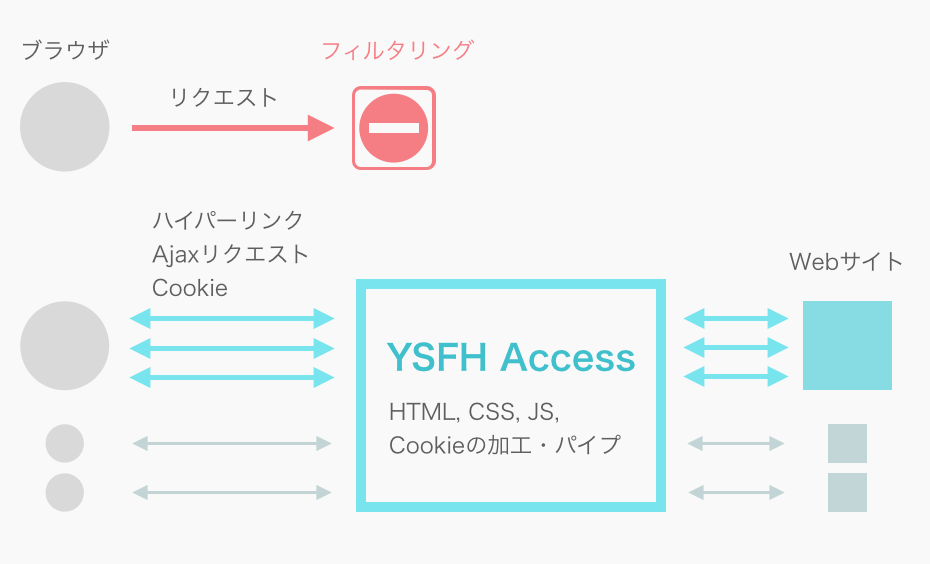

## なにこれ

YSFH Accessは高校のインターネットのフィルタリング機能を回避するために作ったWebプロキシサイトです。

高3の時に、Proxysite.comの代わりとなるものを作りたくてNode.jsで開発しました。

<p>
  
</p>

当時はYouTube, Twitter, Facebook, Google画像検索などを利用できました。

<s>2019年11月に再公開はじめました。 [https://acccess.iciclize.net/ysfhaccess/](https://access.iciclize.net/ysfhaccess/)</s>
(公開終了しました)

## 概要

YSFH Accessは、ドキュメントを中継するときにその中身を適切に書き換えることで、ブラウザで新たに発生するリクエストがなるべくYSFH Accessを経由するようにしてバイパスを行います。

<p>
  
</p>

## HTML, CSSに含まれる参照URLの解決

YSFH Accessは、他のWebページのHTML, CSSをバイパスするとき、そのドキュメントに含まれる `` などといった参照URLを解決しています。

たとえば、ドキュメント `https://example.com/yjsnpi/114514.html` に含まれる `` は `` に解決します。

## XHRをハックしてAjaxリクエストをバイパス

HTMLの先頭に、組み込みのXHRオブジェクトを置き換えるスクリプトを仕込むことで、Ajax通信もバイパスできるようになっています。

YSFH AccessでYouTubeが観られるのはこのおかげです。

キモは以下のコードで、ブラウザに送るドキュメントの `<head>` タグ内に以下のコードを入れておくことで、あるXMLHttpRequestが送信される直前に、そのXMLHttpRequestの宛先をYSFH Accessに書き換えます。

```
var forwardUrlPrefix = (YSFH AccessのURL);
var xhr = window.XMLHttpRequest.prototype.open;
window.XMLHttpRequest.prototype.open = function() {
  arguments[1] = new ysfhResolve(arguments[1], location.href).href;
  if (arguments[1].substr(0, forwardUrlPrefix.length) == forwardUrlPrefix)
    arguments[1] = forwardUrlPrefix + Base64.encodeURI(arguments[1].substr(forwardUrlPrefix.length));
  } else {
    arguments[1] = forwardUrlPrefix + Base64.encodeURI(arguments[1]);
  }
  return xhr.apply(this, Array.prototype.slice.call(arguments));
};
```

こうすることで、たとえば `youtube.com` に直接届くはずだったリクエストがYSFH Access経由となり、うまくリクエストがバイパスされるわけです。

## Cookieの書き換え

YSFH Access経由でほかのサイトにログインできるようにするためには、Cookieの書き換えが必須です。

YSFH Access経由で `example.com` にID/パスワードを送信して、セッションクッキー `session` が `example.com` から返されたとします。

YSFH Accessはこの `session` という名前のクッキーを `ysfh11_1_7_example.com/session` という、

```
{接頭辞ysfh}{Domainの長さ}_{Pathの長さ}_{本来のCookie名の長さ}_{Domain}{Path}{本来のCookie名}
```

 の形をした名前のCookieに変換してブラウザに渡します。

こうすることで、YSFH Accessは、リクエストをバイパスするとき「Cookie名の中に含んだDomain」を見て、代理アクセスしようとしているサイトに対して適切なCookie情報を送ることができます。

このやり方はProxysite.comに倣っています。

## その他の工夫と限界

宛先URLとして、ドメイン名なしでパスだけのURLへのリクエストが飛んでくることがあります。こういうときは、リファラを参照してURLを解決します。

また、特定の文字列(Google画像検索に特有の文字列など)が含まれていた場合、特定のドメイン名へのリクエストであるとみなしてURLを解決するAd hocな対処をしたりしています。

HTMLやCSSに含まれるURLを解決するときですが、なるべく早くブラウザに最初の1バイトを送信したいので、HTML, CSSを取得し次第URLを書き換えていくTransformStreamモジュールを作ってURL解決を行っています。(頭の悪い実装なので実際は文書を全部取得してから変換したほうが早そう)

YSFH AccessではAjaxリクエストは中継できますが、今のところ、javascriptで動的に生成されたタグによって発生した通信を中継することはできません。DOM生成を監視すればできないこともないっぽいので気が向いたらやろうかなとは思います。

<p>
  
</p>

## 開発中の実験の様子

ブラウザがlocalhost以外のホストに接続できない(直接インターネットに繋がらない)ようにファイヤウォールを設定した状態でYouTube動画を再生するテストです。

<blockquote class="twitter-tweet" data-lang="en"><p lang="ja" dir="ltr">やったぜ。<br />ローカルホスト以外との通信を遮断した状態でYoutubeを観ることに成功したゾ。<br /><br />これで学校からどんなサイトでも閲覧できるサービスが作れるってはっきり分かんだね。 <a href="https://t.co/Sh1hIGqz3w">pic.twitter.com/Sh1hIGqz3w</a></p>&mdash; いの (@iciclize) <a href="https://twitter.com/iciclize/status/700346247161327617?ref_src=twsrc%5Etfw">February 18, 2016</a></blockquote>

リポジトリ: [https://github.com/iciclize/YSFHAccess](https://github.com/iciclize/YSFHAccess)
