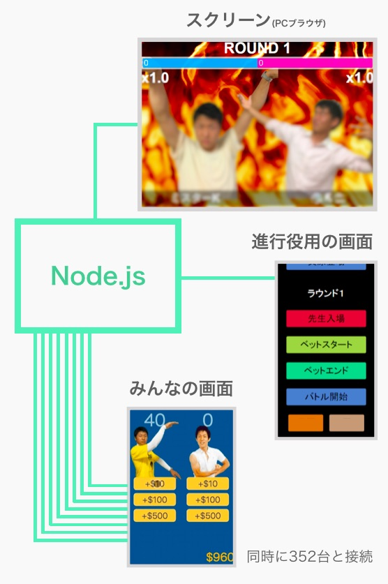

## なにこれ

高校の文化祭の後夜祭で行われた腕相撲大会で、勝敗を予想して賭けを行うシステムをNode.jsで作りました。

対戦する両者に賭けられた金額に応じてリアルタイムにオッズが変動し、それがステージ上のスクリーンに反映されます。

会場の参加者には$1000が与えられ、腕相撲で戦う「ミスターK」と先生のうち勝つと思う方に各自のスマートフォンで持ち金を賭けてもらい、最終的に持ち金が多い上位5位の人がミスターKと握手できるという企画です。

二人で開発しましたが、私は主にバックエンドとスクリーンの表示を作っていたと思います。

352台との同時接続が確認できて感動したプロジェクトです。

## 構成

VPSとしてAzureを使っていたと思います。

Node.jsのサーバーとスマートフォンとはSocket.ioで接続しています。

## セッションについて

クライアントのページを再読込するとサーバーとの接続が切れてしまうため、勝ち取った金額を受け取りそびれる可能性がありました。

そこで、端末ごとにセッションを生成し、ベットを行った情報や現在の金額、勝ち取った金額などをサーバーに保持しておき、ユーザーの勝利金額をセッションに対して付与するようにしました。

こうしておけば、もし勝利金額を付与するタイミングでクライアントとの接続が切れていても、クライアントがそのセッションに再び接続し直すことで勝利した分の金額を受け取った状態を復元することができますね。

## 感想

エラーでサーバーが終了してしまわないかヒヤヒヤしましたが、停止することなく約350台の端末と同時に接続できて興奮しました。

しかし、賭けた金額がそのまま没収されるバグが多く発生したようです。なんでや。

二人で1週間ほどかけて開発したのですが、最後の3日間がほぼ徹夜状態でかなり辛かったです。

徹夜続きだったので文化祭二日目に寝坊してしまいクラス写真に写れなかったのが今でも心残りです。悲しいなぁ… <small>(Array.prototype.sort()は元の配列の順番を崩すからArray.prototype.concat()で配列のコピーを作ってから実行しなければならないと知っていれば寝坊せずにクラス写真に写れたかもしれない…)</small>
