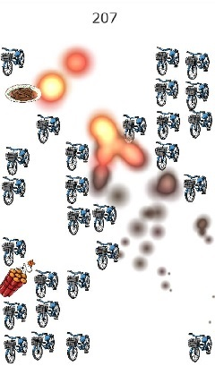
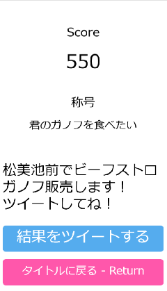

## なにこれ

春日エリアクラス代表者会議による学園祭模擬店「春日ビーフストロガノフ」のプロモーション用のゲームを制作しました。

[迫真ガノフ部〜春日エリアの裏技](https://iciclize.github.io/kasuganoff)

ビーフストロガノフを指で弾いて飛ばし、爆破した自転車の数に応じて称号が与えられ、その結果をツイートできるようになっています。

エンジンにはPhina.jsを使いました。

### 爆発のエフェクト

爆発のエフェクトは自前で実装しましたが、放射状に透明になる円を重ねていくだけでかなりそれっぽいものが作れて驚きました。

### 称号

<small>不必要にインスタンスの生成と破棄を繰り返すダメプログラムのため時間が経つと動作が非常に重いです。</small>
