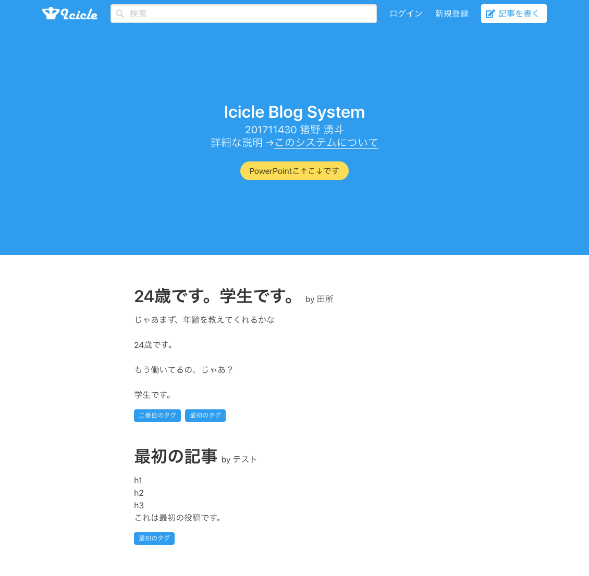
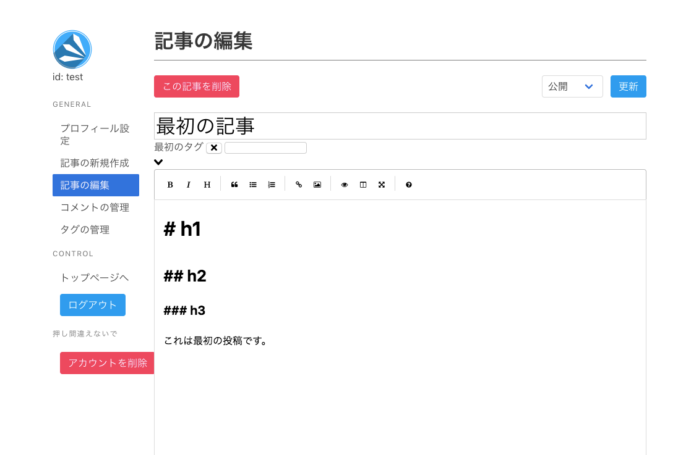
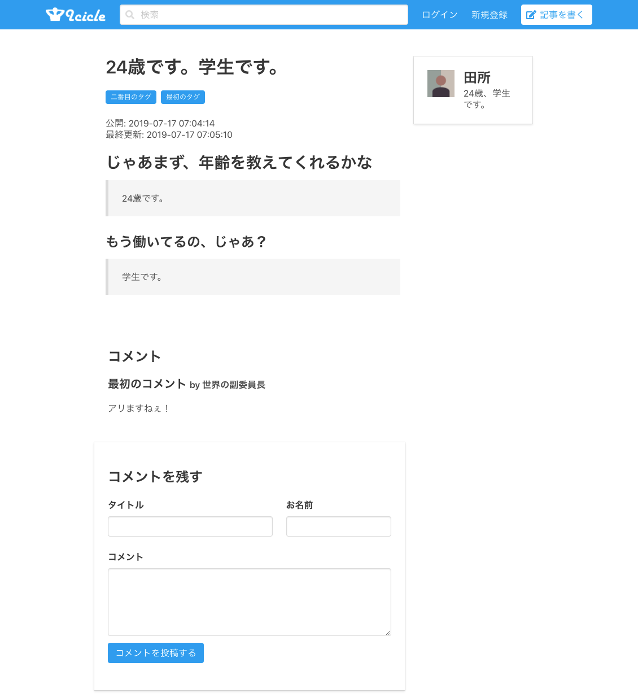
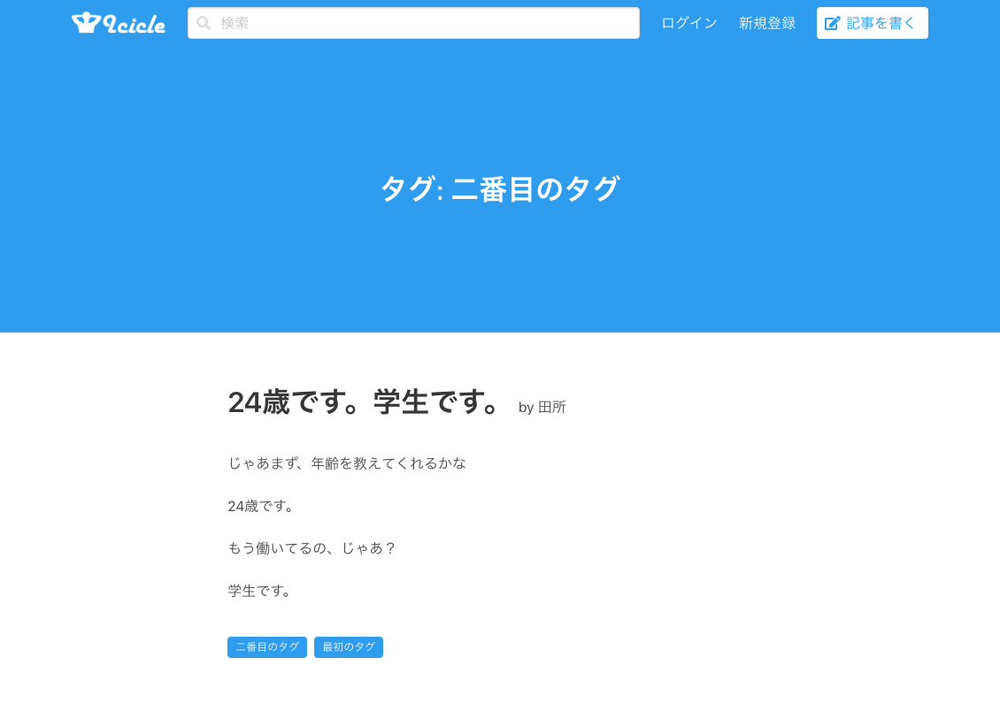

## なにこれ

Icicle Blog Systemは大学のデータベースの授業の課題で作ったブログシステムです。

PHP + MySQL + Vue.js + Bulmaで作りました。

課題自体はデータベースを使ってPHPで何か簡単なシステムを作るというものなのですが、ブログシステムを作ることに決めた結果、思ったより作業量が多くて、1週間くらい大学の計算機室に夜中までこもって作業するというのをやる羽目になってすごい大変だった記憶があります。

当時は「ブログの自作にはロマンがある」と思って作り始めましたが、作ってみて、面倒臭すぎて二度とやりたくねえと思いましたね。CMSの自作はしなくていいです✋

Vue.js使ったことなかったんですが、Vue Componentsが便利すぎて泣きました。

(今思えばVue.jsに限らずPHPもMySQLもBulmaも初めてでした)

## トップ画面

## 記事編集画面

タグが付けられる。そういえばプロフィール画像を除く画像の投稿は実装していない気がします。

## 記事ページ

コメントも付けられる。

## 絞り込み・検索

タグ, 書いた人, 本文・タイトルで検索できる。

